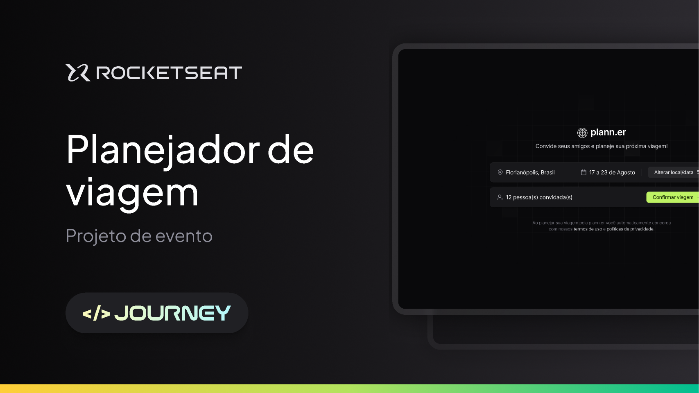

<h1 align="center">
  Plann.er
</h1>

<p>
  
</p>

## 💻 Sobre

**Plann.er** é um sistema de planejamento de viagens, onde você pode criar planos de viagem detalhados com seus amigos, cadastrar atividades, adicionar links úteis e muito mais. A ferramenta oferece diversas funcionalidades para facilitar a organização e tornar sua viagem ainda mais agradável.

Essa aplicação foi desenvolvida durante o evento **Next Level Week Journey** da [Rocketseat](https://www.rocketseat.com.br/) utilizando principalmente tecnologias como `Node`, `TypeScript`, `Fastify` e `React`.


## ⚙ Instalação

### 📝 Requisitos

Antes de baixar o projeto é necessário ter as seguintes ferramentas já instaladas:

* [Git](https://git-scm.com)
* [NodeJS](https://nodejs.org/en/)
* [NPM](https://www.npmjs.com/)

### Configuração

```bash
# Clone este repositório
$ git clone https://github.com/Franklin-Barbosa/NLW-JOURNEY-Planer.git

# Acesse a pasta do backend:
$ cd backend

# Instale as dependências
$ npm install

# Crie o arquivo '.env' e preencha as variáveis conforme o arquivo '.env.example'
$ .env

# Execute a aplicação em modo de desenvolvimento
$ npm run dev

# A aplicação inciará na porta 3333 que você configurou no arquivo '.env'
# Em outro terminal acesse a pasta do frontend
$ cd frontend

# Instale as dependências
$ npm install

# Execute a aplicação em modo de desenvolvimento
$ npm run dev

# A aplicação inciará na porta padrão do vite, 5173
```

### Documentação

Após o servidor backend estar rodando, é possível acessar ele através da rota `/docs` na aplicação. Caso tenha utilizado a porta padrão (3333), o endereço será: `http://localhost:3333/docs`

## 🛠 Tecnologias

### Backend
- **[TypeScript](https://www.typescriptlang.org/)**
- **[Fastify](https://fastify.dev/)**
- **[Prisma](https://www.prisma.io/)**
- **[Zod](https://zod.dev/)**
- **[Nodemailer](https://nodemailer.com/)**
- **[DayJS](https://day.js.org/)**

### Frontend
- **[React](https://react.dev/)**
- **[ReactRouter](https://reactrouter.com/en/main)**
- **[TailwindCSS](https://tailwindcss.com/)**
- **[Tailwind-Variants](https://www.tailwind-variants.org/)**
- **[React-Day-Picker](https://daypicker.dev/)**
- **[LucideReact](https://lucide.dev/guide/packages/lucide-react)**
- **[Axios](https://axios-http.com/)**

> Para mais detalhes das dependências gerais da aplicação veja os arquivos de cada componente [package.json](./backend/package.json) e [package.json](./frontend/package.json)


## ✏️ Layout do projeto
Você pode visualizar o layout do projeto através [desse link](<https://www.figma.com/design/602kvOvQrxN5PxvTiSE68s/NLW-Journey-%E2%80%A2-Planejador-de-viagem-(Community)?node-id=0-1&t=2WxJfE8luYZ9oTJV-0>). É necessário ter conta no [Figma](http://figma.com/) para acessá-lo.